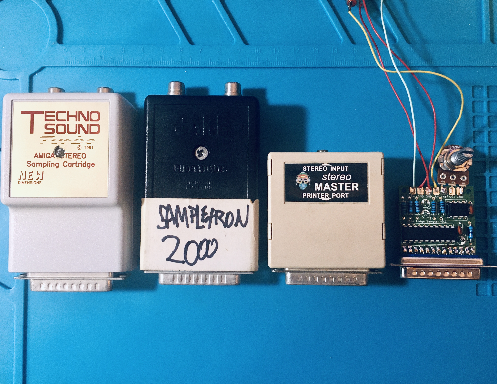
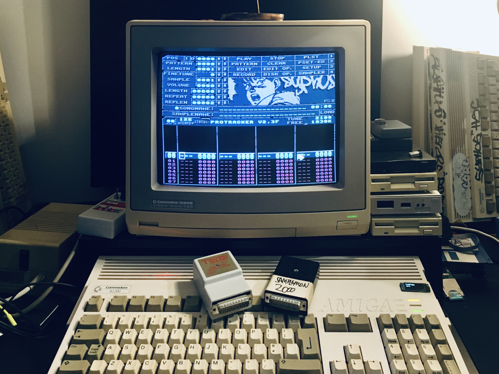
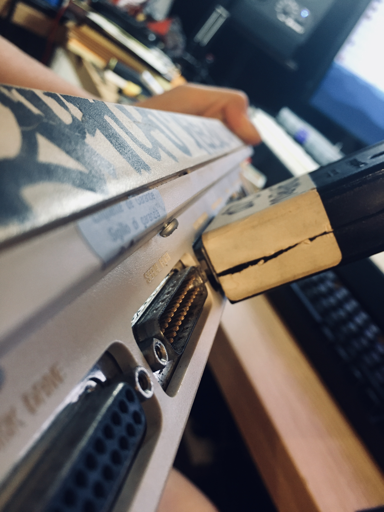
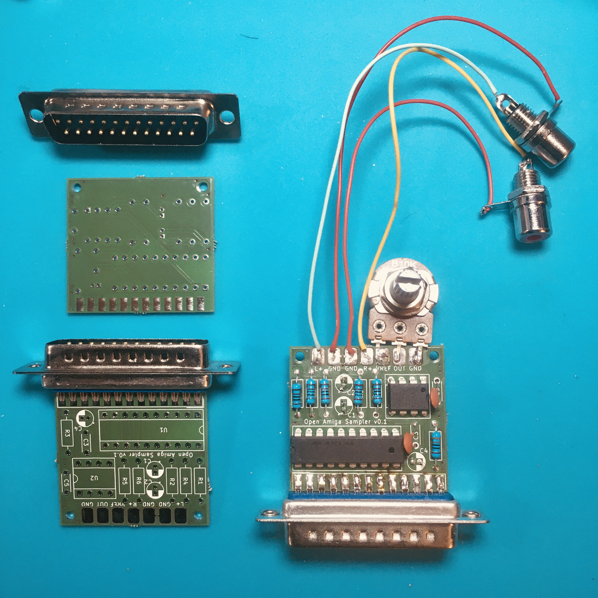

# OPEN AMIGA SAMPLER

## Open source schematics, parts lists and documentation for building a generic 8bit/mono Amiga sampler cartridge

### Contents

* [What are Amiga samplers?](#what-are-amiga-samplers)
* [Why build more?](#why-build-more)
* [How do they work?](#how-do-they-work)
* [WARNING](#warning-warning)
* [That sounds serious. How did you test your design without risking your Amiga hardware?](#that-sounds-serious-how-did-you-test-your-design-without-risking-your-amiga-hardware)
* [So why is your new sampler design mono, not stereo?](#so-why-is-your-new-sampler-design-mono-not-stereo)
* [What's the aim in terms of quality and application?](#whats-the-aim-in-terms-of-quality-and-application)
* [What about those edge cases? Who is OAS _not_ aimed at?](#what-about-those-edge-cases-who-is-oas-not-aimed-at)
* [How compatible is OAS with existing software?](#how-compatible-is-oas-with-existing-software-work-in-progress-submissions-welcome)
* [What next?](#what-next)
* [Appendix A: Sample rates deep-dive](#butbutwhy-cant-sampler-carts-do-55khz-in-trackers)
* [Appendix B: Sampling duration deep-dive](#okwell-what-about-sampling-duration-whys-it-so-short-when-sampling-in-trackers)

### What are Amiga samplers?
Over the course of the Commodore Amiga's active lifespan, a great many samplers (also known variously as sampler carts/cartridges, sound cards, audio digitisers, audio interfaces, etc) were manufactured to exploit audio capabilities that were unmatched by any other home computer of its time. In 1989 an Amiga 500 with a cheap 8bit parallel-port sampler gave you the means to produce professional sounding music in your bedroom for a few hundred pounds - about the same as it cost to hire a recording studio for a few days. Acid house and techno were exploding; hardcore, jungle and drum'n'bass were just around the corner. Even if your sample-based Amiga music wasn't quite professional sounding by the standards of audiophiles and hi-fi enthusiasts and the old-fashioned music industry, it was probably good enough for underground clubs and illegal raves! Countless dance, bass and electronic music superstars got their start with an Amiga and a cheap sampler.

Some samplers back then cost a lot of money and offered advanced features or higher quality than the rest, although there was (and still is) a fundamental limit to the sound quality it's possible to squeeze out of an Amiga. This project is a clone of the typical low-budget sampler design that flooded the market in the late 1980s and early 1990s. They're often referred to as 'carts', but they're actually not cartridges: they're usually small 25-pin parallel port dongles whose circuit boards and connectors are housed in the type of plastic shell that systems like the C64 and the VIC-20 used as cartridge housings. But some manufacturers called them cartridges, and we've been calling them carts for decades, so we'll stick with that. Some live in separate boxes attached by a parallel extension cable to the Amiga's printer port, and some connect to both parallel _and_ serial ports, or even to a joystick port, as a hacky but clever way of getting up to 16bit resolution. Interesting stuff, but out of this project's scope for now!

The common features of these cheap sampler carts were:
* 8bit sample resolution
* Stereo or mono
* Typical maximum sampling rate of ~55Khz in mono (~37Khz for stereo)
* Usually claimed to feature impressive SNR, anti-aliasing filters, and special ~90Khz frequency modes (_sometimes_ these claims were even true!)

The feature set of the Open Amiga Sampler is:
* 8bit sample resolution
* Mono
* Typical maximum sampling rate of ~52Khz
* Input amplifier with variable gain

In this document we'll explain how the OAS works, why and how we developed it, why we've chosen specs which appear to be lower than even the cheap samplers of the Amiga's heyday, and why that's actually a good thing!

### Why build more?

Up until a few years ago, if you needed an 8bit sampler cartridge for your Amiga you'd usually ask on a forum and quickly get a response from somebody either willing to sell theirs for some small amount, or even send one to you for free. But something's happened to Amiga hardware in recent years...second-hand prices have exploded, parts have become more scarce, and it's getting harder and harder for those of us who still produce Amiga music - in the demoscene, in the chiptune scene, and even professionally in the games industry - to maintain our equipment or ensure that it's possible and affordable for newcomers to add the Amiga to their music production toolbox.

So the main reason for doing this is that we're sort of outraged by how much money is changing hands for these sampler carts - often way more than their original market value. That's not unusual for vintage computer equipment, but usually expensive vintage computer equipment is terminally out of production and derives its value from genuine scarcity. But these things? They're still just a few dollars' worth of components, just as they were 30 years ago! So we wanted to make them available to anyone who needs one.

Another reason is that one of us fried a cart years ago, and we thought it would be fun to work out how to bring it back to life (spoiler: _both_ IC chips turned out to be fried - after replacing them, it's as 'good' as new!) We'll explain later how you can avoid frying your sampler carts - not least because usually when you fry your sampler, you also fry the Amiga. Whoops.

### How do they work?

The way these samplers work is no great mystery, and it's precisely because their manufacture was so mercilessly low-cost that they're relatively easy to understand. Most of them contain a small PCB with an 8bit AD (analogue to digital) converter chip, a switching chip that's controlled by voltage (usually a quad bilateral switch), a couple of resistors and capacitors, and a 25-pin parallel port connector. That's all! The AD chip is 8bit/mono and capable of being driven at fairly high speeds - considerably faster than most Amigas would be able to drive it.

If the chip is mono, wouldn't you need two for stereo? Nope, that's what the switch is for: first read a sample byte from the left channel, then use the switch to send the right channel to the AD, read another sample, switch back, and so on. Sounds like an exercise in cost cutting, and it _is_, but since the Amiga's parallel port can only read 8 bits of data at a time, the luxury of dual AD chips wouldn't actually help (that's why some samplers got higher bitrates by simultaneously sending extra bits of data through the serial or joystick ports and adding them together in software to get e.g. 12, 14 or 16bit audio).

We'll not concern ourselves here with _how_ the AD chip converts analogue audio input into 8bit digital output (if you're interested, check out some datasheets for chips like the ZN449, the AD7576 or the ADC0820 which detail their internal circuitry). We're more interested in how to control these chips - to instruct them to start a conversion (a 'sample' of the incoming audio), write the resulting byte to its output data pins, and then do it all over again really fast: as many times per second as our desired sample rate. Oh, and specifically, how to do that with an Amiga!

As you know, the Amiga is the best at everything. No surprise, then, that it has the best parallel port spec! (Actually the Amiga 1000's parallel port was a bit weird, but that's another story.) It's very easy to use, and very flexible due to the fact that its 8 data lines and some of its control lines are bidirectional. A very simplified explanation of how it's used for sampling is as follows:
* Our Amiga (ASM, C, etc) code performs a read of the parallel port's data byte at the relevant hardware address
* The Amiga's CIA chip automatically fires a STROBE signal on Pin 1 every time a data byte is read

That's it! But that's no good - we've only got one sample byte, and it's either empty or gibberish because the sampler hadn't been instructed to perform an analogue-to-digital conversion. That's what the STROBE signal instructs it to do. It performed the conversion AFTER we read the byte. So:
* We set up a loop in our code, using an interrupt to set the speed of this loop - and the speed of the loop should be our desired sample rate
* We come to terms with the fact that the first data byte we read will always be useless - perhaps we don't mind, or perhaps we chop it off later, it doesn't matter
* That first data byte read will trigger the first STROBE, and then the loop of "read byte from parallel pins -> send STROBE -> trigger new conversion on AD chip -> AD chip sends byte to parallel pins" continues until we break it (often with a mouse click, or automatically if we run out of memory to store all these bytes)
* Usually we'll send every incoming byte to Paula, the Amiga's audio chip, to be played back from the Amiga's audio output. This means we can monitor the incoming signal even if we're not storing the data anywhere - useful to decide if we need to tweak the input level, wait for just the right moment to start recording, or whatever.

So the bare minimum the Amiga needs to do is to read bytes and send STROBE pulses at some arbitrary fixed rate. That rate, according to the Nyquist–Shannon sampling theorem, should be greater than double the highest frequency you want human ears to be able to hear, but it also needs to be lower than the highest sample rate the Amiga is capable of playing back - so between about 8Khz and 40Khz is what most Amiga musicians will use in normal circumstances.

Some Amiga software lets you use a slider to choose an arbitrary sample rate, whereas Protracker samples at the 'note' of your choice between C-1 and B-3. The note references a lookup table of sample periods, which divide e.g. a PAL Amiga's clock rate of 3546895hz (NOT the processor _speed_ which varies from model to model) to calculate an interrupt frequency that serves as the sample rate. For example, the note A-1 with a finetune offset of 0 has a period of 508, so 3546895/508 = 6982.07Hz, so if you want a sample rate of about 7Khz, you sample at Protracker note A-1. YES, THAT'S WEIRD. Protracker's weird. Amazing and beautiful and weird. The external sound source that you sample at 'note A-1' doesn't have to be a real-world A-1 note (which would have a frequency of 55Hz, as it happens). It could be anything. So assuming your sound source is playing at the pitch you want to record, the PT note at which you sample is just a metric of sample rate and a way of deciding your preferred quality-to-filesize ratio. Oh, and remember I mentioned PAL? That clock rate is different on NTSC machines which means that, you guessed it, pitches are all slightly different  If all this makes _sort of_ but not _complete_ sense, welcome to Protracker!

### :warning: WARNING

That's almost all you need to know about the Amiga's parallel port and sampling capabilities - but not quite. There's also a WARNING!

It is quite easy to KILL AN AMIGA by doing unexpected things to its parallel port. Specifically, you're likely to kill one of your Amiga's CIA (Complex Interface Adapter) chips and they're both expensive and difficult to replace in A1200 and A600 machines. They're easier to replace in an A500/+, but still expensive. Samplers use the parallel port, so take lots of care. ABSOLUTELY DO NOT:
* plug in a parallel port sampler, or any other parallel port device, while the Amiga is turned on
* unplug a parallel port sampler, or any other parallel port device, while the Amiga is turned on
* connect or disconnect audio cables from the sampler if the sampler is plugged into the Amiga and the Amiga is turned on (because you might knock the sampler out of the parallel port and cause a short)
* say bad things about the CIA chips within their earshot

If you get 'lucky' and kill your cheap sampler cart but _not_ your Amiga, then as long as you have some basic soldering skills you can replace the AD and switch chips for a couple of dollars.

And it goes without saying, but we'll say it anyway: we're not responsible for damage caused by anything you stick in your Amiga's parallel port, even if it's something you made based on these schematics which we've made available for free and done our best to test before publishing. We've tested our design extensively on two Amiga 600s, four Amiga 1200s, two Amiga 500s and one Amiga 500+. We make no promises about compatibility with the Amiga 1000 and its slightly different parallel port spec - we've never even seen one in real life, frankly. They were (and still are) pretty rare in Europe/UK.

By the way, here's some extra advice for free: don't plug or unplug ANYTHING when your Amiga is turned on. You can fry something even by fumbling around at the back with a phono cable and accidentally raking some IO pins, causing a short. Just don't do it!

### That sounds serious. How did you test your design without risking your Amiga hardware?

For initial diagnostics, to establish exactly how the samplers' inputs were being addressed by the Amiga but without risking any possibility of causing a short on an Amiga's parallel port, we used a Teensy 3.5 dev board (similar to an Arduino but a bit more powerful and flexible) to emulate what we thought was happening and see how the samplers responded. We also read a lot of very old and badly scanned datasheets from the 1980s and spent a lot of time with a multimeter and a serial monitor. We needed to not only work out how e.g. the Techno Sound Turbo worked, but also how different variations of the 'cheap sampler' design were able to be addressed generically by non-proprietary software packages (e.g. Protracker, which works with almost any sampler, as opposed to software packages that came bundled with specific samplers and sometimes allowed custom functionality to be used).

We used the Teensy 3.5 rather than the 3.6 because its data pins are 5v tolerant for input, even though the Teensy itself runs at and outputs 3.3v signals. This is important because the Amiga's parallel port outputs a +5v reference voltage that powers the sampler's chips, and so the signals that are returned on the data pins are also in the 5v range. Also, because all Teensy boards have 3.3v output pins, we needed to use a multi-channel logic level converter board to convert all our control signals (STROBE, PAPER_OUT and SELECT) to 5v. Conveniently, the sampler and the logic level converter can be powered from the Teensy's 5v USB input supply.

Another reason to use the Teensy 3.5 is that it has a built-in SD card, so we're able to write incoming data bytes to a raw file as signed 8bit values (in the range of -128 to 127), and then convert these files to WAV to check whether they sound...anything like they're supposed to. For a while, friends, _they absolutely did not_! But then we gradually figured out everything we were doing wrong and got it working.

And yes, similar to the way the Amiga reads from the sampler, our Teensy code has a fast loop (the main loop with some 5 and 40 microsecond delays to approximate the sample rate we wanted) and feeds the samplers a sensible rate of STROBE pulses that cause it to return useful amplitude values.

### So why is your new sampler design mono, not stereo?

Good question. Stereo seems like it would be a desirable feature, but our design is intended to be a practical and affordable one for people who still regularly use their Amiga to make music, or want to get into it. We both have an Amiga/PC demoscene background, and one of us has been composing Amiga music and performing it live for decades. There are various ways of using the Amiga to make music, and some people may need to record and play back samples in stereo, but for the most part the Amiga's polyphony restrictions (4 channels) mean that playing back stereo in MOD or MED music is a profligate waste of resources. Stereo takes up twice as much space on disk or in RAM, _and_ the maximum sample rate is much lower than in mono. It's possible to play back stereo in Protracker MODs, but it involves splitting the signal and playing each side on a separate channel - not unheard of, but pretty rare.

The only area in which the Amiga wasn't G.O.A.T. was the unfortunate design decision to force two audio channels fully to the left, and two fully to the right - aka hard panning. Lots of YouTube retro gaming videos - and even some Amiga music videos - deliberately preserve this hard panning and the result, if you're listening on headphones or a proper stereo speaker configuration is usually appalling. Back in the day, we got around this either by plugging our Amigas into cheap televisions (which usually had single mono speakers or stereo speakers with such little separation on either side of a tiny CRT tube that the signals blended quite well) or by building small mixer circuits that reduced the panning separation to somewhere between 0 and 10%.

Until and even since Commodore's demise, a staggering amount of music has been produced on the Amiga and most respected composers in the demoscene, netlabel scene or games industry (the lines between these categories often blur) compose in mono in the expectation that their music will be listened to in mono. The groundbreaking netlabel Mono211, one of the first netlabels and later known as Monotonik after evolving from its Amiga roots, was thus named partly because their releases were intended to be heard in mono to avoid horrible situations like, for example, all of a drum and bass tune's drums being heard only through the left ear of a pair of headphones, and all the bass being heard only through the right.

So our sampler mixes down stereo input to mono, because it's what we want, and what most musicians want, and it's better. Some people may disagree. They're welcome to add a quad bilateral switch (or similar) to the circuit, and perhaps we'll publish some advice for how to get that working if we have time or there's lots of demand, but realistically stereo sampling on the Amiga has become an edge case; a niche feature.

How did most of the original cheap samplers handle mono sampling from a stereo input? Pretty simple: they only sampled the left channel. It's possible that some only sampled the right, if their resistors were wired up differently to the switch's control inputs, creating an alternative default channel. Remember: the data bus is only 8 bits wide, and this is an 8bit mono AD, so it has no means of digitally mixing the two signals internally and (if we want the highest sample rates possible) we don't want to sample from both channels and then mix in software on the Amiga. So we mix the analogue audio signal where it enters the sampler, with a few resistors to ensure that there's no voltage feedback or weird clipping/signal loss when L and R are merged. Different resistor values (or even both wired to a physical switch, if you're feeling adventurous) can be used to configure the input for headphone vs line level signals.

### What's the aim in terms of quality and application?

We haven't tried to make the BEST sampler, but the general benchmark we had in mind was that it should sound at least as good as a Techno Sound Turbo, and hopefully a little better. Lower/mid-range samplers like the GVP DSS8+ incorporated preamp circuits and ADCs with allegedly better SNR performance, and while we haven't the information or the means to clone these directly, we are implementing a filter and preamp circuit of our own to hopefully improve SNR. Higher-end samplers, as discussed earlier, use various port tricks to achieve higher bitrates and (on accelerated Amigas) higher sample rates but they're often operating outside the ability of a stock Amiga to replay those samples usefully.

Our benchmark in terms of application, or what it should be possible to use this sampler for, is that it should work with most versions of Protracker, OctaMED, and similar trackers. Working with popular audio packages such as Audiomaster II and even some of the software that came bundled with the original commercial samplers, now largely in the public domain, is a bonus - but usually cheap samplers will work in most of these apps when treated as generic sampling devices and so should ours. Typically if a sampler-specific app has an option for controlling a special feature of that app, it'll use the PAPER_OUT and SELECT pins of the Amiga's parallel port to send custom messages and these will usually be ignored by a third-party sampler such as ours. So far, compatibility is high - but again, trackers are the critical use case and anything else is a bonus.

### What about those edge cases? Who is OAS _not_ aimed at?

We're sure there are Amiga users out there who don't use trackers and perhaps aren't interested in the sound quality compromises that trackers require composers to make. We feel that anybody who uses their Amiga for 12, 14 or 16-bit sampling, perhaps in stereo with a view to high-quality or mixed-stereo playback on an accelerated machine, and maybe even through a clockport or Zorro sound card that uses the AHI drivers and bypasses Paula's DMA channels (other than to drive its PWM output), is not the target user for this device! Chances are they already have the equipment they need; we don't seek to diminish what they do, nor insult them by pretending our design is any use to them, and we wish them well! Indeed constructing a setup like that is quite an achievement, considering the scarcity of Delfina, Toccata and similar high-end sound cards. Some people even use a Mediator busboard so they can run Soundblaster 16s and other PCI cards of the era!

So if you've got this far through the documentation, it shouldn't be a surprise that we're not even pretending to offer that kind of quality or cater to that adjacent - but very different - use case :)

### How compatible is OAS with existing software? (work in progress, submissions welcome)

_TL;DR The OAS works with most sampling programs and sample trackers, and in future this table will probably be more useful as a list of
anomalies which don't, or software that's exclusively targeted at proprietary hardware. As a rule, anything that works with a MasterSound, a StereoMaster, a TechnoSound Turbo, a MegaloSound, or any other low-to-mid range 8bit sampler will probably work with the OAS._

| Software | OAS rev. | Works? | Notes |
| -------- | -------- | -------|------ |
| ProTracker 1.2/2.3D/2.3F | 0.1 | :heart: | |
| AudioMaster III | 0.1 | :heart: | |
| MasterSound v1.1 | 0.1 | :heart: | |
| MED v3.22 | 0.1 | :heart: | |
| TrashTracker | 0.1 | :heart: | |
| MegaloSound 1.39 | 0.1 | :heart: | |
| StereoMaster 1.1 | 0.1 | :heart: | |

### What next?

We now have circuit boards designed, made, populated and tested! Results are good: with OAS at a healthy gain just short of clipping, and with a short repeating source loop at a fixed professional line level (2 bars of a liquid drum and bass track containing sub-bass, complex synth pads, lead synths and crispy hi-hats), the sampled audio is considerably louder than that from a Techno Sound Turbo and also has much better low and high frequency response. High frequency response is never going to be amazing with an 8bit sampler, but it should be possible to get decent low frequency response - often it's preferable to use a short sinewave 'chip' sample (ie ~64bytes) because sampling sub bass can give such poor results, but even in the context of a full mix the OAS delivers way more below 115hz than the Techno Sound Turbo. We haven't done a comparison test against the Stereo Master because it's objectively much worse than the Techno Sound Turbo anyway :) The next test we'd like to do is against a GVP DSS8+ which, since it also has a built-in preamp (albeit software rather than hardware controlled), is more likely to give OAS a run for its money. But those samplers are very rare these days and expensive when they do appear on the second hand market, so we feel we've achieved our goal already!

The case design is nearly complete and prototype 3D prints are looking good. More on that soon!

### Appendix A: Sample rates deep-dive

"But why don't most sample trackers let you record and play at the highest sample rates the hardware can support? Why are they limited to 28603Hz (PAL) and 28867Hz (NTSC), rather than say 55Khz or higher? After all, most samplers' bundled sampling programs could do that!", we hear you ask. Well, there are a couple of things going on here.

Firstly, those figures of 28603Hz (28.6Khz) and 28867Hz (28.8Khz) are important because while the theoretical maximum sample rate of Paula (ie the rate at which its PWM output can switch on and off) is about 31Khz, there are some limitations imposed by the chipset internals of the Amiga - detailed on page 260, Appendix A of the Amiga Hardware Reference Manual if you want to dive even deeper. Each Paula channel's playback frequency is derived from the system's clock speed (not the CPU clock, but the master clock from which all custom chips and the CPU derive their speeds) which is 3546895Hz on PAL systems and 3579545Hz on NTSC systems. This clock speed is divided by a value from a look-up table of 'periods' - ie PWM interrupt intervals - which correspond with the desired audio playback sample rate. What do PAL and NTSC have to do with it? More on that later.

It _is_ possible to play back audio data at sample rates higher than those practical limits, and most trackers have a few entries in their note period look-up tables that correspond to such rates (generally A-3, A#3 and B-3), but you should expect results to be unpredictable and probably way out of tune with notes further down the scale. That doesn't mean they're useless - those notes and their commensurate high quality can still be useful for unpitched stuff like snares or hi-hats, or even for melodic/harmonic content that never needs to change pitch, but if your channel effects ever raise the pitch (vibrato or arpeggio for example) then horrible things will probably happen to your ears. And if not yours, then probably somebody else's when they listen to your module on a different system. On a PAL machine, A-3 is 27.928Khz and A#3, a semitone up, is 29.557Khz; the aforementioned practical limit falls between these semitones, so your realistic upper limit when tracking should be A-3, and perhaps even G-3 to be safe.

Secondly, those references to PAL and NTSC timing remind us that everything about the Amiga's custom chip architecture, and the rates at which those custom chips' DMA runs, is linked to video display timing. It's an ideological relic of the Amiga's time, and it's why the system was so great at what it did. So if you've used sampler carts in the past, especially with their bundled sampling programs, you'll remember that it was possible to record and play back EXTREMELY high-quality audio - in sample rate terms, at least. But you'll also remember that the screen went blank or froze both when recording and replaying in these high quality modes. And even in Protracker the screen goes blank when doing the actual recording (not monitoring) of a sample.

Each Paula channel gets one DMA slot per horizontal display scanline, so to monitor (without recording) incoming sampler audio, most programs can continue to update their graphics while playing back that incoming sound _and_ doing some basic analysis on the signal to display waveform scopes or VU meters. But in order to record, including at rates higher than our 'limit', the screenmode has to be changed to one that performs horizontal scans at a rate which allows Paula DMA access at a higher frequency. To play back these samples, programs like TechnoSound Turbo, MegaloSound, MasterSound etc. also need to change their display modes and blank/freeze their screens because playback in the program's default displaymode would be limited to ~28Khz and so the sample would sound waaaaay downpitched, usually by around an octave.

So we're sure you're ahead of us on this: trackers don't care about anything that exceeds the ~28Khz limit, because trackers are for composing modules which need to be replayable alongside games, demos, cracktros and the like without forcing those programs to change screenmodes or blank/freeze their screens; they also need to use all 4 channels independently, so can't double up for crazy 14bit playback tricks or whatever. If you sample an instrument in MegaloSound at the highest possible mono samplerate (let's say ~55Khz) and load that sample in ProTracker, even playing B-3 on the keyboard will sound about an octave lower than you expect. To get it to sound right you'll have to upsample it by an octave...which discards every other sample so you can play back at a higher frequency...and now you've lost half the sample information, the sample is around 28Khz, and you might as well have sampled at 28Khz in ProTracker in the first place :D

So...that was a long and rambling but hopefully edifying explanation for why - although it's possible to sample at rates way in excess of CD quality - the safe, everyday, practical upper limit of any Amiga sampler cart if you're a tracker musician is pretty much A-3.

Here's a table of ProTracker's notes, note period values, and corresponding PAL and NTSC sample rates (rounded to nearest). You can also finetune up or down by 8 increments between semitones (aka half-steps), so for a comprehensive table of all the intermediate periods check out [the Protracker page on exotica.org.uk](https://www.exotica.org.uk/wiki/Protracker). It's just a quick reference to give you an idea of which PT note will give you which sample rate - don't rely on it for any serious maths!

###### Octave 1

PAL 3546895
NTSC 3579545

| PT Note | C-1 | C#1 | D-1 | D#1 | E-1 | F-1 | F#1 | G-1 | G#1 | A-1 | A#1 | B-1 |
|    ---  | --- | --- | --- | --- | --- | --- | --- | --- | --- | --- | --- | --- |
| PT Period | 856 | 808 | 762 | 720 | 678 | 640 | 604 | 570 | 538 | 508 | 480 | 453
| PAL sample rate | 4144|4390|4655|4926|5231|5542|5872|6223|6593|6982|7389|7830
| NTSC sample rate |4182|4430|4698|4972|5280|5593|5926|6280|6653|7046|7457|7902

###### Octave 2

| PT Note | C-2 | C#2 | D-2 | D#2 | E-2 | F-2 | F#2 | G-2 | G#2 | A-2 | A#2 | B-2 |
|    ---  | --- | --- | --- | --- | --- | --- | --- | --- | --- | --- | --- | --- |
| PT Period | 428 | 404 | 381 | 360 | 339 | 320 | 302 | 285 | 269 | 254 | 240 | 226
| PAL sample rate |8287|8779|9309|9852|10463|11084|11745|12445|13185|13964|14779|15694
| NTSC sample rate |8363|8860|9395|9943|10559|11186|11853|12560|13307|14093|14915|15839

###### Octave 3

| PT Note | C-3 | C#3 | D-3 | D#3 | E-3 | F-3 | F#3 | G-3 | G#3 | A-3 | A#3 | B-3 |
|    ---  | --- | --- | --- | --- | --- | --- | --- | --- | --- | --- | --- | --- |
| PT Period | 214 | 202 | 190 | 180 | 170 | 160 | 151 | 143 | 135 | 127 | 120 | 113
| PAL sample rate |16574|17559|18668|19705|20864|22168|23489|24803|26273|27928|29557|31388
| NTSC sample rate |16727|17721|18840|19886|21056|22372|23706|25032|26515|28185|29830|31677

### Appendix B: Sampling duration deep-dive

"Ok...well what about sampling duration? Why's it so short when sampling in trackers?", we hear you ask. Like the previous question, this pertains to all sample carts (not just ours) but unlike the previous question, it's much more straightforward to answer.

You'll have noticed that when sampling at e.g. tracker note A-3 (which we've established is usually the highest note/sample rate that you'll want to use for anything melodic/pitched) you get only a few seconds before sampling ends and you're dropped back to the main screen. But you've got acres of chip mem available! Entire continents of fast ram! All those old bundled sampler programs let you program at higher rates than this for aaaages!

Well, this is partly a limitation of the MOD format - established by Karsten Obarski for SoundTracker and then refined slightly over the years by successive NoiseTracker and ProTracker coders. Almost all MOD trackers will cut off sampling just before it hits 64KB (even though the format can technically support 128KB - but that's another story). It is what it is; we're not entirely sure why this limitation exists, but we're used to working around it and so is everyone who's ever composed a module.

You might find that sampler programs suit your workflow better, in that you prefer to record a much longer duration in one go and then save out selected chunks for loading into ProTracker later (ProTracker and its fellows will just read the first 64KB of a >64KB sample and discard the remainder, so don't worry about overloading it with samples that are too big). Or you can get used to doing what we do: looping your source material on whatever device you're sampling _from_ and having a quick mouse-trigger-finger on the Amiga's record button.

But remember: even with the dedicated sampling programs you'll eventually run up against the limit of your system's chip mem - the main Amiga RAM type that's optimised for fast DMA access by the custom chips. Unless a program does some fiendish and CPU-intensive data juggling, most sampling programs won't be able to use your fast mem for this, so beware of splashing cash on fast RAM expansions if all you want to do is tracking. Find out much more about different Amiga RAM types and what they mean for ProTracker by reading [the guide I wrote in bootPT's documentation](https://github.com/echolevel/bootPT#the-protracker-users-guide-to-amiga-ram-types-limitations-and-expansions).
