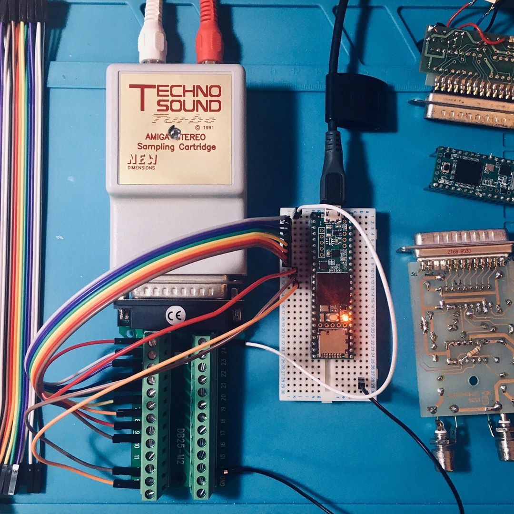

## Teensy Amiga Sampler Tester

We used this Teensy-based project to test original sampler carts and also our prototype builds of OAS without the risk of damage to our Amiga hardware.

The .ino is annotated with hopefully enough clues to get you going, though I'll make a diagram when I have time.

Some notes:
* the use of non-sequential digital pins for reading data is due to the way GPIO is laid out in the bare-metal Teensy architecture - using the pins I specify allows you to do a FAST byte read (doing it the slow way is too slow for our purposes)
* you don't really need to be alternating the STATUS and PAPER_OUT high/low if you're testing a mono sampler, as these are used to flip most cheap stereo samplers' quad bilateral switch ICs (to alternate the ADC's input providing data bytes in stereo with only one ADC). Setting one as high and the other as low and then leaving them should be fine. You can also do this to get mono (ie either left or the right channel) audio from a stereo sampler
* the STROBE, STATUS and PAPER_OUT signals need to be raised from Teensy's 3.3v output level to the 5v that the Amiga needs. This can be done with a bi-directional logic level converter, ideally with 4 channels. You can feed the converter the 5v it needs from a small hole next to the Teensy 3.5's USB input (refer to your Teensy's documentation). This hole usually won't align to a breadboard, so it's probably best to solder your 5v wire to it..
* be sure to wire up EVERY ground pin on the DB25 connector properly (see the Amiga parallel pinout below)
* the DB25 connector also needs 5v - again, get this from the Teensy's USB input.

### Amiga Parallel Pin Reference

Remember: we're mimicking an Amiga's parallel port so our female DB25 connector, wired up to the Teensy, is what a sampler sees when it's plugged into the real thing.

| DB25 Pin | Teensy pin | Purpose | Notes |
|-----|----|---------|-------|
|1| 9 | STROBE | must be at +5v reference level |
|2| 2 | Data 0 | |
|3| 14 | Data 1 | |
|4| 7 | Data 2 | |
|5| 8 | Data 3 | |
|6| 6 | Data 4 | |
|7| 20 | Data 5 | |
|8| 21 | Data 6 | |
|9| 5 | Data 7 | |
|10| | ACK | unused |
|11| | BUSY | unused |
|12| 10 | PAPER_OUT | must be at +5v ref level |
|13| 11 | SELECT | must be at +5v ref level |
|14| VUSB | +5V |
|15| | | not connected  |
|16| | RESET | unused |
|17| GND | GROUND |
|18| GND |  GROUND |
|19| GND |  GROUND |
|20| GND |  GROUND |
|21| GND |  GROUND |
|22| GND |  GROUND |
|23| GND |  GROUND |
|24| GND |  GROUND |
|25| GND |  GROUND |
